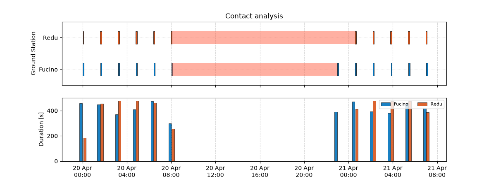
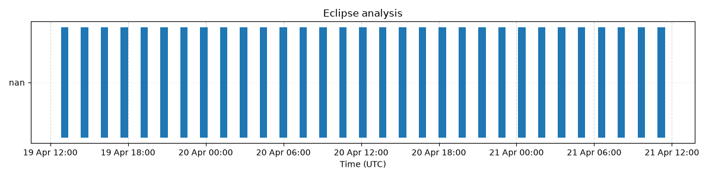

# Scenario 01 — Mission Analysis: ISS visibility over multiple ground stations

Baseline mission analysis in GMAT: propagation of a real satellite from a TLE, and analysis of ground station contacts and eclipses.

## Objective

Given a TLE, answer the basic mission analysis questions:

- When is the satellite visible from each ground station (AOS/LOS, duration)?
- How long are the gaps between consecutive passes, and when is the longest one?
- What fraction of time is the satellite covered by each station?
- When and for how long is the satellite in eclipse?


### Initial state

The initial state is computed once from the TLE file via SGP4 (Skyfield) and written into the GMAT script as a Cartesian state.

> TLE orbital elements are *mean* elements defined for SGP4: they cannot be typed directly into GMAT as osculating Keplerian elements. Passing the Cartesian state computed by SGP4 avoids this mismatch.

## Repository layout

```
01_mission_analysis/
├── README.md
├── initial_state_from_TLE.py      # TLE -> initial state -> GMAT script
├── analyse_results.py             # reads GMAT reports, statistics and plots
├── gmat_files/
│   ├── mission_template.script    # template with placeholders (versioned)
│   └── generated/                 # generated scripts (not versioned)
├── output/                        # GMAT reports and plots (not versioned)
└── ../src/
    ├── astrodynamics.py           # TLE reading, SGP4 initial state
    └── data_analysis.py           # report parsing, gap statistics
```

## How to reproduce

1. **Set the TLE and start date** in `initial_state_from_TLE.py`, and the ground stations in the `ground_stations` dictionary.
2. **Generate the GMAT script**:
   ```bash
   python -m S01_mission_analysis.initial_state_from_TLE
   ```
   The script is written to `gmat_files/generated/`, with absolute output paths pointing to this project's `output/` folder. Generated scripts contain machine-specific paths and are not committed.
3. **Run the script in GMAT** (GUI): open the generated `.script` and run. GMAT writes `ContactLocator.txt` and `EclipseLocator.txt` in `output/`.
4. **Analyse the results**:
   ```bash
   python -m S01_mission_analysis.analyse_results.py
   ```

The main function concerning astrodynamics and data analysis are tested with GMAT `R2026a` and Python `3.13.0`. To run the tests:
```bash
   pytest
```

## Results: ISS over Redu, Svalbard and Fucino

### Initial state

The initial state is computed via a TLE file from CelesTrak (updated 27.09.2026). To limit the position error, the propagation's epoch is set to 28.0.2026 and lasts two days.
The following initial cartesian state (in J2000 RF) is computed with the `initial_state_from_TLE.py` script:

| State | Value | Unit |
|---|---|---|
| Epoch | 19-28-2026 12:00:00| UTCGregorian |
|GMAT Epoch | 31881.0000 | UTCModJulian|
| X |  2000.6176 | [km] |
| Y | -3836.8969 | [km] |
| Z |  5176.6191 | [km] |
| VX |  7.2809 | [km/s] |
| VY |  2.1467 | [km/s] |
| VZ | -1.2236 | [km/s] |

Furthermore, the selected Ground Stations are:

|GS| Latitude [deg] | Longitude [deg] | Altitude [km] | Min. Elevation [deg]|
|---|---|---|---|---|
| Redu | 50.0022 | 5.1478 | 0.145 | 5 |
| Svalbard | 78.9296 | 11.8653 | 0.075 | 5 |
| Fucino | 41.9766 | 13.6029 | 0.680 | 5 | 

### Contact statistics

| Ground station | N. passes | Mean duration [s] | Max duration [s] | Mean gap [h] | Max gap [h] | Total coverage [s] | Coverage [%] |
|---|---|---|---|---|---|---|---|
| Redu | 11 | 478 | 512 | 11379 | 59951 | 4785 | 4.484| 
| Svalbard | 0 | 0.000 | 0.000 | - |  - |0.000 | 0.000|
| Fucino | 12 | 413 | 478 | 10720 | 59465 | 4546 | 4.082 |

Furthermore, the first contact is here reported:
| Ground station | First contact | Unit |
|---|---|---|
| Redu | 2028-04-20 00:02:54 | UTCGregorian |
| Svalbard | None | UTCGregorian |
| Fucino | 2028-04-20 00:00:16 | UTCGregorian | 

### Contact timeline

The following plot shows the contact timeline. 

In the first panel are compared the contact windows for Redu and Fucino GS: the x-axis is set with the date from the first and the last contact and every section is a contact window. Furthermore, the maximum gap is here shown, useful to comprehend when the ISS stays the most time untracked (by those three GS): this means that no data can be exchanged between the ISS and Earth during that time. Other GS are required for a full covered orbit.

In the second panel are reported the duration of every contact, since in the previous is difficult to read the correct value.

In both plots Svalbard is not shown, due to the lack of contact with the ISS. In fact, Svalbard is a GS that is situated at high latitudes and does not provide coverage to the space station.



### Eclipses

For many satellites it is very important to know when it is in eclipse or not. The consequences reflect on power availability - thus on payload and other subsystems, even proplsion if electric - and thermal effects.

| N. events | Mean duration [s] | Max duration [s] | Mean gap [s] | Total duration [s] | Coverage [%] |
|---|---|---|---|---|---|
31 | 2079 | 2106 | 3447 | 64474 | 38.878 |




## Assumptions and limitations

- TLE + SGP4 is used only to get the initial state; GMAT then propagates with its own force model, so results diverge from SGP4 over time.
- Contacts are geometric (elevation above the station's minimum elevation); no link budget, antenna or scheduling constraints.

## References

- GMAT User Guide — ContactLocator, EclipseLocator, GroundStation
- CelesTrak — TLE data
